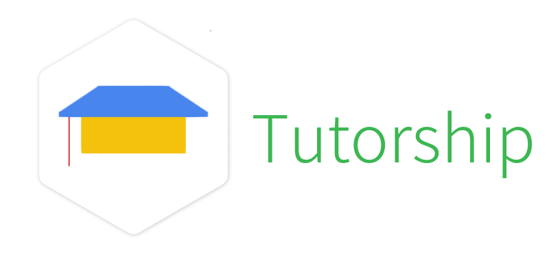

## Introduction

Tutorship is meant to be flexible, easy to use, interactive programming tutorials platform.

## Prerequisites

Tutorship depends on the following software:

- Nodejs ( 6.x )
- Angular 2 ( 2.x )
- ExpressJS ( 4.x - with compression )
- Webpack ( angular-cli )


### Installation

- Clone this repository

```bash
$ git clone https://github.com/tutorship/app.git
```

- Install dependencies

```bash
$ cd app
$ npm install
```

- Run development server

```bash
$ npm start
```

- Alternatively, you can run production server

```bash
$ npm run build
$ node dist/bin/www.js
```

## Deployment

### Heroku

[](https://heroku.com/deploy?template=https://github.com/tutorship/app/tree/master)

### Docker

You'll need at least Docker 1.12.

If you don't already have it installed, follow the instructions for your OS:

- On Mac OS X, you'll need [Docker for Mac](https://docs.docker.com/engine/installation/mac/)
- On Windows, you'll need [Docker for Windows](https://docs.docker.com/engine/installation/windows/)
- On Linux, you'll need [docker-engine](https://docs.docker.com/engine/installation/)

#### Build your image

```bash
$ docker build -t <your-name/your-image-name> .
```

#### Test your image

```bash
$ docker run -p <port>:3000 <your-name/your-image-name>
```

If everything went OK, then open the browser and visit http://localhost:<port>


## Licence

Tutorship is available as open source under the terms of the [MIT License](http://opensource.org/licenses/MIT).
